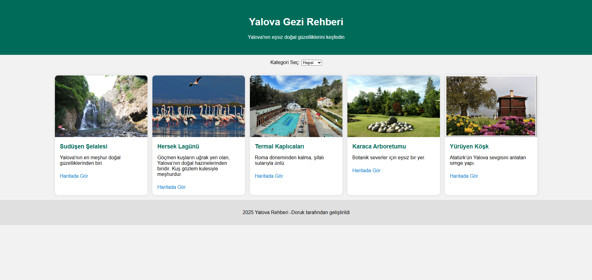

# 🌿 Yalova Gezi Rehberi

Bu proje, Yalova'nın doğal ve tarihi güzelliklerini tanıtmak için geliştirilen bir web uygulamasıdır. HTML, CSS ve JavaScript kullanılarak yazılmıştır.

## 🖼️ Önizleme

## 🚀 Özellikler

- Kategoriye göre filtreleme (Doğa, Tarih, Kaplıca vs.)
- Google Maps bağlantıları
- Görsellerle zenginleştirilmiş yer kartları
- Genişletilebilir veri yapısı
